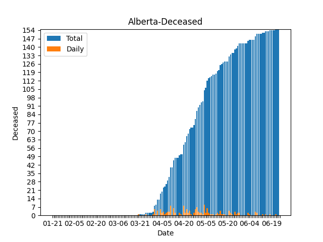
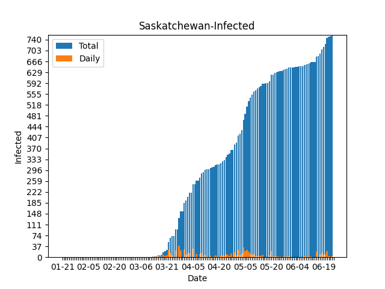
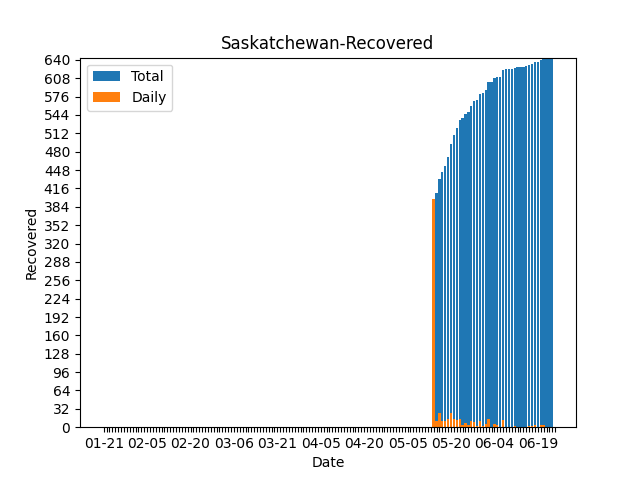
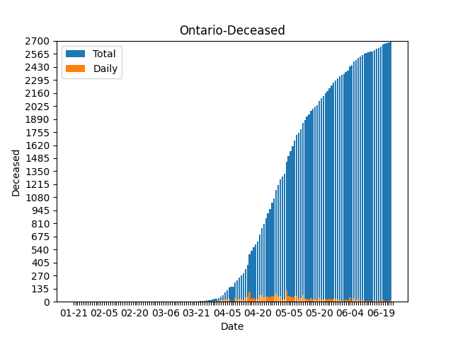

# British Columbia
## British Columbia-Infected

## British Columbia-Recovered

## British Columbia-Deceased

# Alberta
## Alberta-Infected

## Alberta-Recovered

## Alberta-Deceased

# Saskatchewan
## Saskatchewan-Infected

## Saskatchewan-Recovered

## Saskatchewan-Deceased

# Manitoba
## Manitoba-Infected

## Manitoba-Recovered

## Manitoba-Deceased

# Ontario
## Ontario-Infected

## Ontario-Recovered

## Ontario-Deceased

# Quebec
## Quebec-Infected

## Quebec-Recovered

## Quebec-Deceased

# New Brunswick
## New Brunswick-Infected

## New Brunswick-Recovered

## New Brunswick-Deceased

# Nova Scotia
## Nova Scotia-Infected

## Nova Scotia-Recovered

## Nova Scotia-Deceased

# Prince Edward Island
## Prince Edward Island-Infected

## Prince Edward Island-Recovered

## Prince Edward Island-Deceased

# Newfoundland and Labrador
## Newfoundland and Labrador-Infected

## Newfoundland and Labrador-Recovered

## Newfoundland and Labrador-Deceased

# Yukon
## Yukon-Infected

## Yukon-Recovered

## Yukon-Deceased

# Northwest Territories
## Northwest Territories-Infected

## Northwest Territories-Recovered

## Northwest Territories-Deceased

# Source
All counts taken from [CTV](https://www.ctvnews.ca/health/coronavirus/tracking-every-case-of-covid-19-in-canada-1.4852102)

